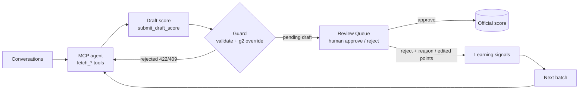

# ai-qa-scoring-hitl

An AI agent drafts quality scores for support conversations through MCP tools, deterministic guardrails validate every draft, and a human approves or rejects it in a review queue before anything becomes an official score. A golden-set evaluation measures how often the AI agrees with human reviewers.

## Problem

Scoring support conversations by hand does not scale, and letting an LLM write scores straight into reports is not trustworthy. This repo shows the middle path: the model proposes, code checks, a person decides, and the person's corrections flow back into the next run.

## How it works



## Tech

Node 24, built-in `node:sqlite` (plain SQL migrations, no ORM), Hono API, `@modelcontextprotocol/sdk` (stdio), Vite + React + Tailwind review UI, Vitest. Scorers: `mock` (default, deterministic, no key) and `claude` (`@anthropic-ai/sdk`). No Docker.

## Quick start (no API key needed)

```bash
git clone https://github.com/abdalrahmnamo-svg/ai-qa-scoring-hitl.git
cd ai-qa-scoring-hitl
npm ci
npm run seed          # 80 synthetic conversations, 8 human scores, 20 golden scores
npm test              # Vitest, uses the mock scorer only
npm run batch         # the mock scorer drafts the latest day's batch (12 drafts)
npm run dev           # API on :3001 + Review Queue on http://localhost:5173
npm run golden:eval   # agreement between AI drafts and the golden set
npm run mcp           # stdio MCP server (needs QA_MCP_TOKEN; see mcp.example.json)
```

Copy `.env.example` to `.env` to change settings. `SCORER=claude` plus `ANTHROPIC_API_KEY` switches the batch to a real model (not used by tests; not exercised in this repo's CI).

To drive the agent from an MCP client instead of `npm run batch`, start `npm run api`, then register the server using `mcp.example.json` (set the same `QA_MCP_TOKEN` for both). `npm run mcp:smoke` launches it from that config and lists the tools.

## Example

One synthetic conversation, end to end:

1. `CONV-0030`: Customer 2225 cannot sign in after an app update; Agent Foxtrot resets the password.
2. The agent calls `fetch_scorecard_config`, `fetch_learning_signals`, then `submit_draft_score` with every criterion as `{ points, evidence }`, for example `u3: { points: 5, evidence: "Agent wrote: \"I'm sorry you are locked out right now.\"" }`.
3. The guard recomputes `g2` (first reply within 5 minutes) from timestamps, validates the rest, and stores a `pending_human_review` draft. Total: 88/100, flagged "review first" because it sits just under the pass mark of 90.
4. In the Review Queue a reviewer sees the transcript, the evidence per criterion, and similar human scores. They approve as is (official score created, origin `agent_approved`), edit points then approve (origin `human`, each changed criterion becomes a correction), or reject with a reason.

`docs/demo.gif` will be added here (recorded by the owner).

## Engineering notes

**Why drafts never auto-promote.** `draft_scores` and `scores` are separate tables. The only code that inserts into `scores` is `approveDraft` in `server/drafts.js`, reached only from the review routes. The agent's service token is rejected on those routes with 403, the MCP server exposes no approve tool, and a conversation that already has a score or an approved draft cannot receive another draft. A test asserts that submitted drafts leave `scores` untouched.

**What the guard rejects, and why** (`server/draftSubmitGuard.js`, returned as HTTP 422 with every problem listed):
- malformed containers or non-integer points, because totals must be exact;
- unknown or missing criterion ids, so a draft always covers the whole rubric;
- points outside `0..maxPoints`, so one bad value cannot inflate a total;
- missing or thin evidence (under 12 characters, or a bare number), so every point can be checked against the transcript;
- missing reasoning or a confidence outside 0..1.

Separately it blocks (HTTP 409) drafts on conversations that are already scored, already approved, or already waiting for review. `g2` ("first reply within target") is computed server-side from response time and overrides whatever the model sent.

**How golden-set agreement is computed.** The golden set is the 20 conversations whose official score has origin `golden`. The scorer drafts each one (no reviewer feedback applied), `g2` is overridden as in production, and the draft is compared with the human score:
- `withinToleranceRate` (headline): share of conversations where `|AI total - human total| <= 5` points;
- `passFailAgreementRate`: share on the same side of the 90 pass mark;
- `criterionAgreementRate`: share of single-criterion comparisons with identical points;
- `meanAbsTotalError`: mean absolute total difference.

On the seeded synthetic set with the mock scorer, `npm run golden:eval` prints 16/20 within +/-5 points (80.0%), pass/fail agreement 0.9, criterion agreement 0.922 and mean absolute error 3.15, identically on every run. These numbers describe a keyword heuristic against synthetic reviewers, so they are a regression guard for the pipeline, not a claim about any model's accuracy. Golden scores are never returned by `fetch_scored_examples`, so the agent cannot learn the answers.

**MCP token auth.** `qa-mcp/` is a thin stdio server; it never opens the database. Each tool calls the HTTP API with `Authorization: Bearer $QA_MCP_TOKEN`. The API accepts that token only on `/api/agent/*` (constant-time comparison; missing or wrong token gives 401), and refuses it on `/api/review/*`. The server will not start without the token, and the handlers throw before making a request if it is empty.

**Learning loop.** Signals are derived from review history rather than stored separately: rejection reasons, per-criterion differences between a draft and the approved final scores, and a calibration table (mean human minus AI points per criterion). `fetch_learning_signals` returns them; the mock scorer applies calibration to criteria with at least two samples and a clear bias, and the Claude scorer receives the same data in its prompt.

## Limitations

- The mock scorer is a keyword and timing heuristic written against the synthetic dialogue templates; it demonstrates the pipeline, not model quality. `SCORER=claude` is implemented but was not run in this repo.
- The review UI and `/api/review/*` have no login; run them on localhost or put real authentication in front.
- SQLite via `node:sqlite` is experimental in Node and suits a demo or a single-writer service.
- The scorecard is read from the database but there is no admin UI to edit it.
- Only `g2` is deterministic. Everything else relies on the model plus review.

## Background

All data here is synthetic and generated by a seeded script. The design is extracted from a production system I designed and built.
